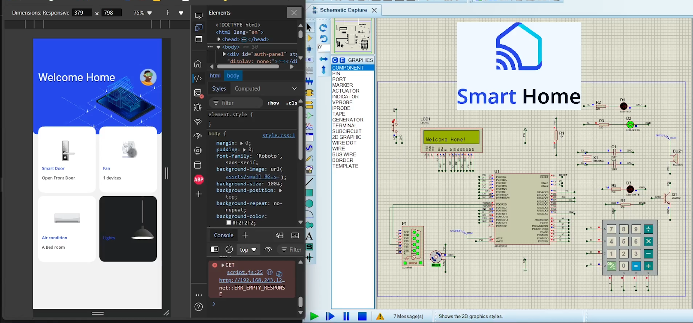

# AVR-Based Smart Home System

## Overview

This project is an AVR-based Smart Home System designed to automate and control various home appliances remotely. The system is built using an ATmega32 microcontroller and an ESP32 module to connect to a server, allowing users to interact with their home environment through a web interface.

## Features

- **Custom Drivers**: Developed drivers for LCD, Keypad, DIO, Interrupts, UART, and more using the ATmega32 microcontroller.
- **Web Interface**: A user-friendly web page that enables users to control lights, locks, and other appliances remotely.
- **ESP32 Integration**: Utilized ESP32 to connect with a server, retrieve data from the web interface, and send commands to the ATmega32 for execution.
- **Real-Time Control**: The system processes commands in real-time, ensuring seamless automation.
- **Proteus Simulation**: Simulated and tested the entire system in Proteus before deployment.

## Project Structure

- **avr/**: Contains the source code for the ATmega32 microcontroller, including drivers and main program logic.
- **web/**: Contains the code for the web interface, allowing users to interact with the Smart Home System.
- **esp32/**: Contains the code for the ESP32 module to handle communication between the web interface and the ATmega32.
- **simulation/**: Contains Proteus simulation files used for testing the system.

## Installation and Setup

1. **Clone the Repository**:
   ```bash
   git clone https://github.com/minaraafat21/smart-home.git
   ```

## Screenshots

Here are some screenshots of the system in action:

### Proteus Simulation


[View full Proteus Simulation Video](https://drive.google.com/file/d/1WiWpaH2GaA1odYufzqTtDdN7IXFVLizi/view)

### Web Interface


